# Multi-Region VPC Connectivity Using AWS Transit Gateway

## Project Overview
This project demonstrates enterprise-level AWS networking by connecting **3 VPCs across 2 AWS regions** (N. Virginia and London) using **AWS Transit Gateway**, without using VPC Peering.

The goal was to prove that EC2 instances in private subnets across different VPCs and regions can communicate with each other securely through a central Transit Gateway hub.

---

## Architecture Diagram

```
                    ┌─────────────────────────────────┐
                    │        US-EAST-1 (Virginia)      │
                    │                                  │
                    │  ┌──────────┐  ┌──────────────┐ │
                    │  │  VPC1    │  │     VPC2     │ │
                    │  │10.0.0.0/16│  │ 10.1.0.0/16 │ │
                    │  │          │  │              │ │
                    │  │ Public   │  │   Private    │ │
                    │  │  EC2-1 ──┼──┼──► EC2-2     │ │
                    │  │  (entry) │  │              │ │
                    │  └────┬─────┘  └──────┬───────┘ │
                    │       └────────────────┤         │
                    │                  TGW-Virginia    │
                    └──────────────────────┬──────────┘
                                           │ TGW Peering
                    ┌──────────────────────┴──────────┐
                    │        EU-WEST-2 (London)        │
                    │                                  │
                    │          TGW-London              │
                    │               │                  │
                    │  ┌────────────┴─────────────┐   │
                    │  │          VPC3             │   │
                    │  │      10.2.0.0/16          │   │
                    │  │                           │   │
                    │  │    Private Subnet         │   │
                    │  │       EC2-3               │   │
                    │  └───────────────────────────┘   │
                    └─────────────────────────────────┘
```

---

## Why Transit Gateway Over VPC Peering?

| Feature | VPC Peering | Transit Gateway |
|---|---|---|
| Connections needed for 3 VPCs | 3 separate connections | 1 central hub |
| Scalability | Gets complex fast | Scales easily |
| Cross-region | Supported but complex | Native support |
| Best practice | Small setups | Enterprise/production |

VPC Peering is **point-to-point** — with 3 VPCs you need 3 separate peering connections. Transit Gateway acts as a **central hub** — every VPC connects once and can reach all others through it.

---

## Resources Created

### Virginia (us-east-1)
- VPC1-Virginia — `10.0.0.0/16` (Public + Private subnet)
- VPC2-Virginia — `10.1.0.0/16` (Private subnet only)
- Internet Gateway attached to VPC1
- Transit Gateway (TGW-Virginia)
- TGW attachments for VPC1 and VPC2
- EC2-1 in VPC1 Public Subnet (entry point)
- EC2-2 in VPC2 Private Subnet
- EC2 Instance Connect Endpoint for VPC2

### London (eu-west-2)
- VPC3-London — `10.2.0.0/16` (Private subnet only)
- Transit Gateway (TGW-London)
- TGW attachment for VPC3
- TGW Peering connection to TGW-Virginia
- EC2-3 in VPC3 Private Subnet
- EC2 Instance Connect Endpoint for VPC3

---

## Key Concepts

**VPC (Virtual Private Cloud)** — An isolated private network inside AWS. Like having your own data center in the cloud where you control all networking.

**Subnet** — A subdivision of a VPC. Public subnets have internet access via an Internet Gateway. Private subnets are isolated from the internet — more secure for sensitive workloads.

**Transit Gateway** — A central network hub that connects multiple VPCs. Instead of messy point-to-point connections, everything connects through a single gateway making the architecture clean and scalable.

**Transit Gateway Peering** — Connects two Transit Gateways in different AWS regions, enabling cross-region VPC communication without exposing traffic to the public internet.

**Route Tables** — Rules that tell network traffic where to go. Each VPC and TGW has route tables directing traffic to the right destination.

**EC2 Instance Connect Endpoint** — Allows browser-based SSH access to private EC2 instances without needing key pairs or a bastion host.

**CIDR Planning** — Non-overlapping IP address ranges across all VPCs ensure routing works correctly.

**Security Groups** — Virtual firewalls for EC2 instances. Configured to allow ICMP (ping) and SSH traffic between VPCs.

---

## CIDR Planning

| Resource | CIDR |
|---|---|
| VPC1-Virginia | 10.0.0.0/16 |
| VPC1 Public Subnet | 10.0.1.0/24 |
| VPC1 Private Subnet | 10.0.2.0/24 |
| VPC2-Virginia | 10.1.0.0/16 |
| VPC2 Private Subnet | 10.1.1.0/24 |
| VPC3-London | 10.2.0.0/16 |
| VPC3 Private Subnet | 10.2.1.0/24 |

---

## Traffic Flow

**Example: EC2-2 (private, Virginia) pings EC2-3 (private, London)**

1. EC2-2 sends packet to `10.2.1.x`
2. VPC2 route table: *"10.2.x.x → send to TGW-Virginia"*
3. TGW-Virginia route table: *"10.2.x.x → forward through peering to TGW-London"*
4. TGW-London route table: *"10.2.x.x → deliver to VPC3 attachment"*
5. EC2-3 receives the ping
6. Reply follows the same path back

---

## Screenshots

### VPCs Created in Virginia
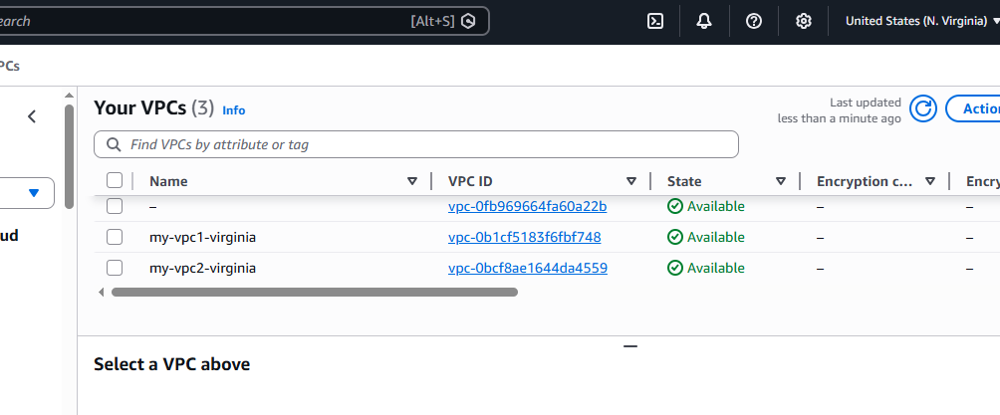

### VPCs Created in London
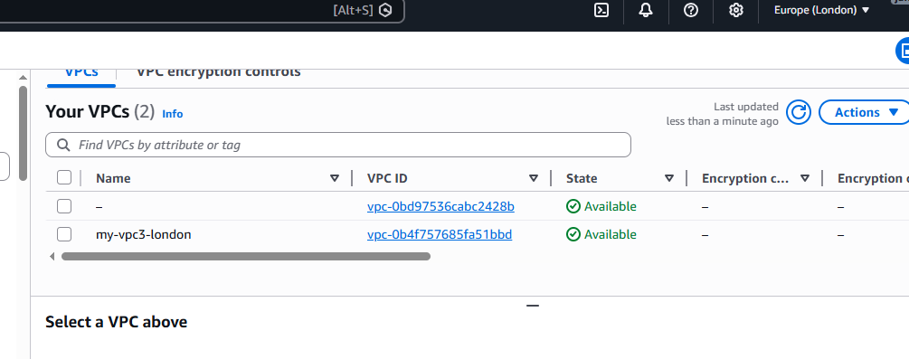

### Subnets in Virginia
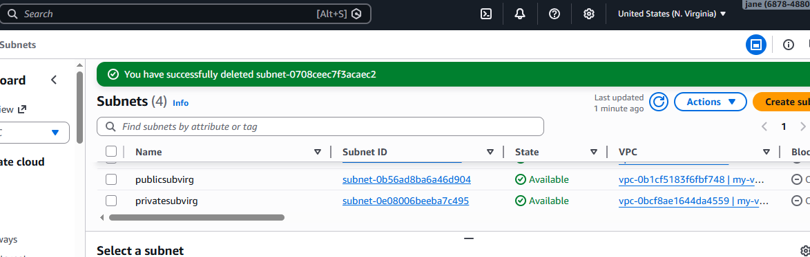

### Internet Gateway Attached to VPC1
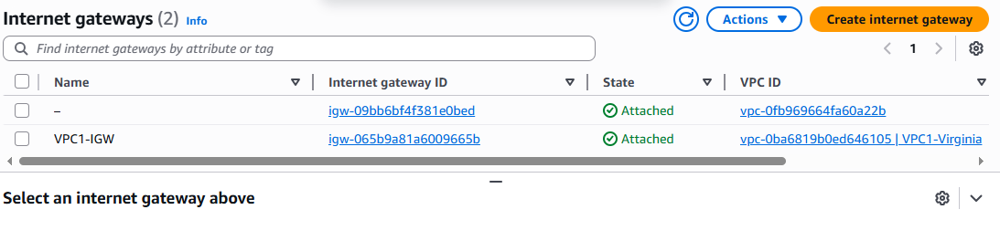

### Route Table for Public Subnet


### TGW Virginia Route Table
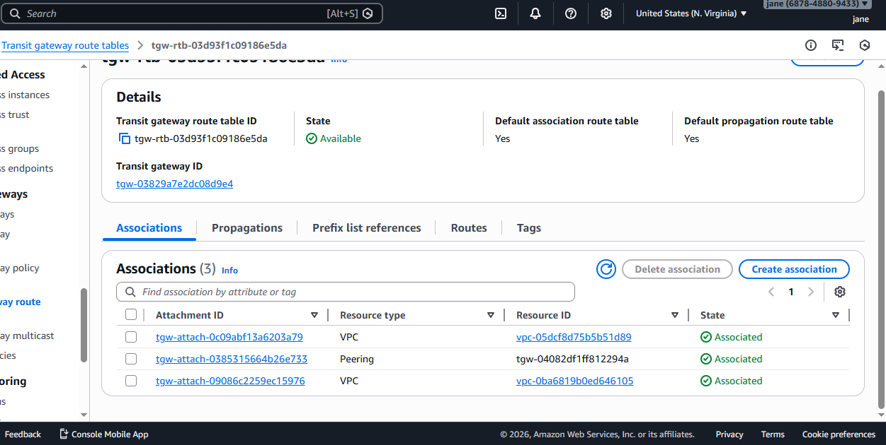

### TGW Peering — Virginia to London
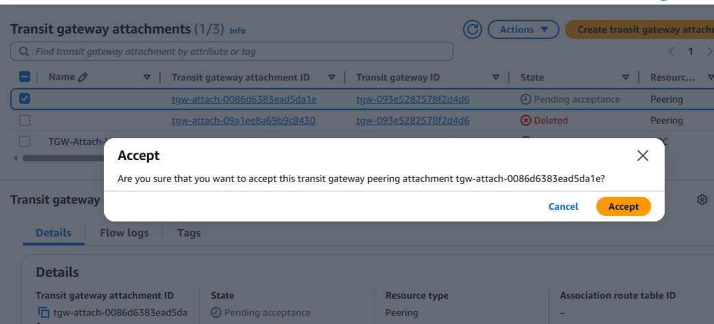

### TGW Peering Available
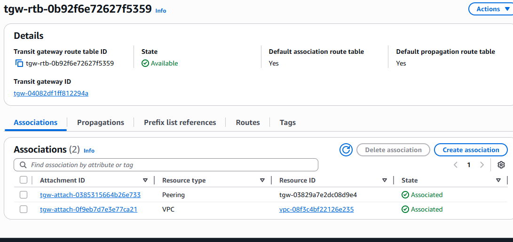

### EC2 Instance Connect Endpoint — VPC2 Virginia


### EC2 Instance Connect Endpoint — London
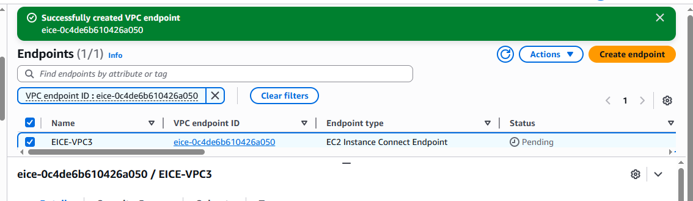

### Instances Running in Virginia
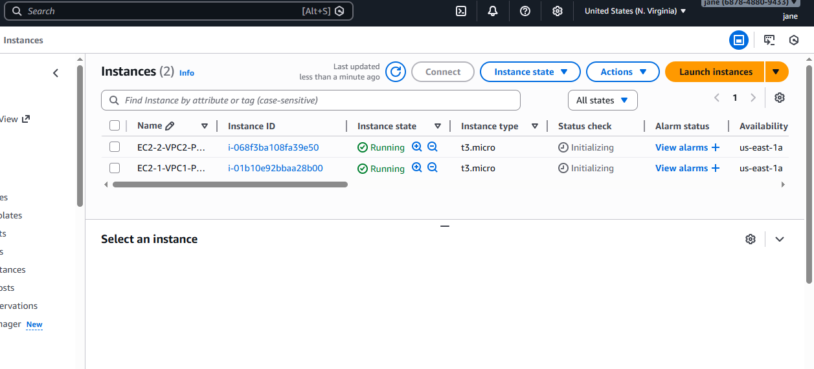

### EC2 Instance — London (Private)
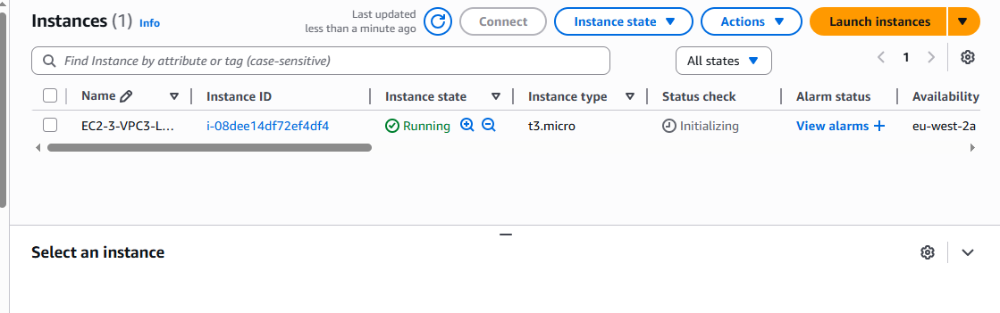

### Connected to EC2-1 (Public Entry Point)
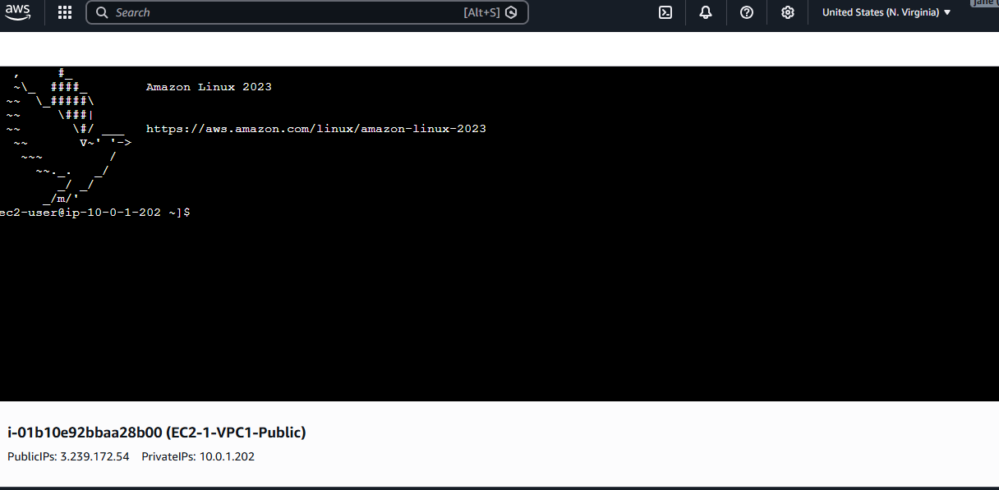

### Connected to EC2-2 (Private via Endpoint)
.png)

### Ping EC2-2 (Virginia Private) from EC2-1


### Ping EC2-3 (London) from EC2-1 ✅ Cross-region proof
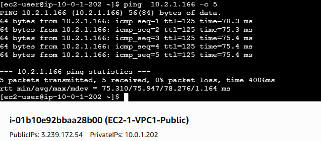

### Ping EC2-3 (London) from EC2-2 ✅ Private-to-private cross-region proof
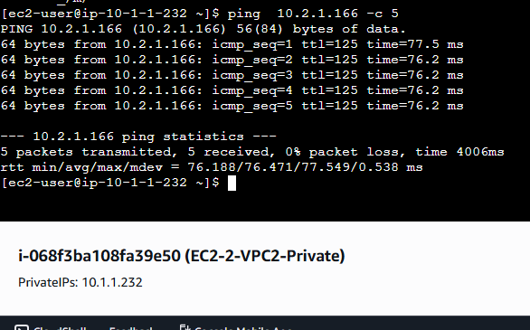

---

## Proof of Concept Results

| Test | From | To | Result |
|---|---|---|---|
| Ping 1 | EC2-1 VPC1 Virginia | EC2-2 VPC2 Virginia | ✅ 0% packet loss |
| Ping 2 | EC2-1 VPC1 Virginia | EC2-3 VPC3 London | ✅ 0% packet loss |
| Ping 3 | EC2-2 VPC2 Virginia | EC2-3 VPC3 London | ✅ 0% packet loss |

---

## Challenges Faced

- **AWS account activation** — virtual card support for Kenya required research into compatible providers
- **TGW peering attachment naming** — the peering attachment appears with a different name in London vs Virginia
- **EC2 Instance Connect Endpoint location** — found under VPC console not EC2 console
- **TGW route tables** — static routes for cross-region traffic must be added manually; only local VPC routes propagate automatically

---

## Cleanup

All resources deleted after project completion to avoid charges in this order:
1. EC2 instances terminated
2. EC2 Instance Connect Endpoints deleted
3. TGW Peering attachment deleted
4. TGW VPC attachments deleted
5. Transit Gateways deleted
6. VPCs deleted

---

## Services Used
AWS VPC · Subnets · Internet Gateway · Transit Gateway · Transit Gateway Peering · EC2 · EC2 Instance Connect Endpoint · Route Tables · Security Groups

---

*Built as part of AWS Solutions Architect learning path following AWS Cloud Practitioner certification.*
